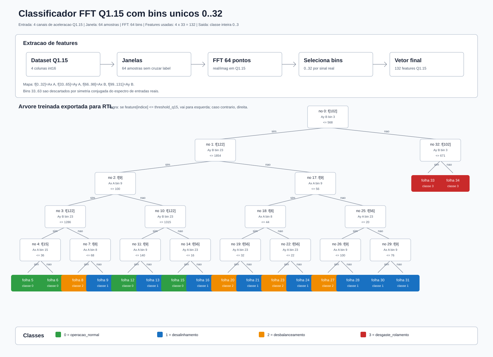

# Classificador FFT Q1.15

Este diretório contém os artefatos do classificador de estado do motor treinado a partir das quatro entradas de aceleração em Q1.15:

- `aceleracao_x_mancal_a`
- `aceleracao_y_mancal_a`
- `aceleracao_x_mancal_b`
- `aceleracao_y_mancal_b`

A cadeia usa janelas não sobrepostas de 64 amostras, aplica a FFT de referência em `03.Reference/fft.py`, requantiza a saída da FFT para Q1.15 e extrai 132 features de magnitude aproximada:

```text
feature = min(32767, abs(real_q15) + abs(imag_q15))
```

Como a entrada da FFT é real, os bins altos carregam informação redundante por simetria conjugada do espectro. Por isso, o classificador usa apenas os bins únicos `0..32` de cada canal: DC em `0`, frequências positivas em `1..31` e Nyquist em `32`. Os bins `33..63` são descartados.



## Classes

| Saída | Classe |
|---:|---|
| 0 | `operacao_normal` |
| 1 | `desalinhamento` |
| 2 | `desbalanceamento` |
| 3 | `desgaste_rolamento` |

## Como Rodar

Execute os comandos a partir da raiz do projeto.

Instale as dependências no ambiente virtual:

```bash
.venv/bin/python -m pip install -r requirements.txt
```

Rode um teste rápido com poucas janelas por classe:

```bash
.venv/bin/python 03.Reference/ml_classifier.py \
  --dataset motor_measurements_q15.parquet \
  --max-windows-per-class 200 \
  --cv-folds 3 \
  --output-dir /tmp/ml_classifier_smoke
```

Liste os datasets Q1.15 válidos em `07.Datasets/processed`:

```bash
.venv/bin/python 03.Reference/ml_classifier.py --list-datasets
```

Atualmente são considerados válidos apenas Parquets Q1.15 com as quatro colunas de vibração. O dataset `motor_vibration_q17.parquet` aparece na pasta, mas é ignorado neste fluxo porque a FFT e o classificador ainda estão fixos em Q1.15.

Rode o treinamento padrão para um dataset específico:

```bash
.venv/bin/python 03.Reference/ml_classifier.py --dataset motor_vibration_q115.parquet
```

Compare automaticamente as abordagens Q1.15 disponíveis:

```bash
.venv/bin/python 03.Reference/ml_classifier.py --compare-q15-datasets
```

Por padrão, o treinamento usa:

- `--dataset 07.Datasets/processed/motor_measurements_q15.parquet`
- `--window-size 64`
- `--max-depth 5`
- `--min-samples-leaf 16`
- `--max-windows-per-class 20000`
- `--test-size 0.15`
- `--val-size 0.15`
- `--cv-folds 5`
- `--output-dir 03.Reference/artifacts/ml_classifier/<dataset_stem>`

Com `--window-size 64`, a FFT ainda produz 64 bins por canal, mas o classificador usa somente:

```text
4 canais x 33 bins = 132 features
```

## Artefatos

| Arquivo | Uso |
|---|---|
| `model.joblib` | Modelo `DecisionTreeClassifier` treinado para uso em Python. |
| `metrics.json` | Acurácia, matriz de confusão, relatório por classe, validação cruzada e contagem das amostras. |
| `tree_q15.json` | Estrutura da árvore pronta para portar para RTL: nós, features, limiares Q1.15 e folhas com classe `0..3`. |
| `feature_map.csv` | Mapa de cada feature para canal de entrada e bin da FFT. |
| `classifier_tree_features.svg` | Imagem com a extração de features e a árvore treinada. |
| `comparison_q15.json` | Resumo da comparação entre datasets Q1.15, criado por `--compare-q15-datasets`. |
| `comparison_q15.csv` | Tabela compacta da comparação entre datasets Q1.15. |

## Resultado Atual

O treinamento padrão de cada dataset gera 20.000 janelas por classe, totalizando 80.000 amostras balanceadas.

Resultado histórico inicial com `motor_measurements_q15.parquet`:

- validação cruzada média: `0.7885`
- validação: `0.7902`
- teste: `0.7852`
- features: `132`
- profundidade da árvore: `5`
- nós da árvore: `35`

Esses valores são apenas uma primeira referência. A prioridade desta versão é manter a cadeia simples para futura implementação em RTL e ponto fixo.

Para saber qual abordagem Q1.15 teve melhor resposta no estado atual do projeto, use `comparison_q15.json`. A escolha é feita por maior acurácia de teste; em empate, por acurácia de validação e depois média da validação cruzada.

Comparação Q1.15 atual:

| Dataset | Teste | Validação | CV média |
|---|---:|---:|---:|
| `motor_measurements_q15.parquet` | `0.7852` | `0.7902` | `0.7885` |
| `motor_vibration_q115.parquet` | `0.7843` | `0.7903` | `0.7883` |

Melhor resposta por acurácia de teste: `motor_measurements_q15.parquet`.

## Formato para RTL

Cada nó interno de `tree_q15.json` segue a regra:

```text
if feature[feature_index] <= threshold_q15:
    next = left_child
else:
    next = right_child
```

Cada folha retorna diretamente a classe inteira `0..3`.

As features são inteiros Q1.15 não negativos entre `0` e `32767`. Cada feature vem de um bin FFT entre `0` e `32`. O classificador não retorna Q1.15; ele retorna apenas o identificador inteiro da classe.
